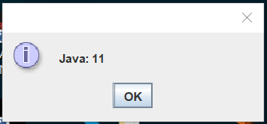

Należy skompilować klasy komendami:
javac --release 9 -d bin\classes9 Java9\*.java
javac --release 8 -d bin\classes8 Java8\*.java
javac --release 10 -d bin\classes10 Java10\*.java
javac --release 11 -d bin\classes11 Java11\*.java

Jar z Wieloma wersjami stworzono komendą:
jar --create --file Multiversion.jar --main-class MainWindow -C bin\classes8 . --release 9 -C bin\classes9 . --release 10 -C bin\classes10 . --release 11 -C bin\classes11 .
Deklarujemy to nazwę jara, głowną klasę i ścieżki do skompilowanych klass dla każdej wersji

Każda wersja wyświetla na początku komunikat z której wersji javy działa.

Potem przy użyciu jpackage poleceniem  
jpackage -i . --name MultiversionAplication --main-class MainWindow --main-jar Multiversion.jar --win-shortcut --win-menu 
stworzono instaler.
W komendzie tej zdefiniowano nazwa instalowanej aplikacji, główną klasę, jar z którego go wykonać i skrót na pulpit i do menu start.

Następnie przy pomocy instalera pomyślnie zainstalowano program na komputerze

